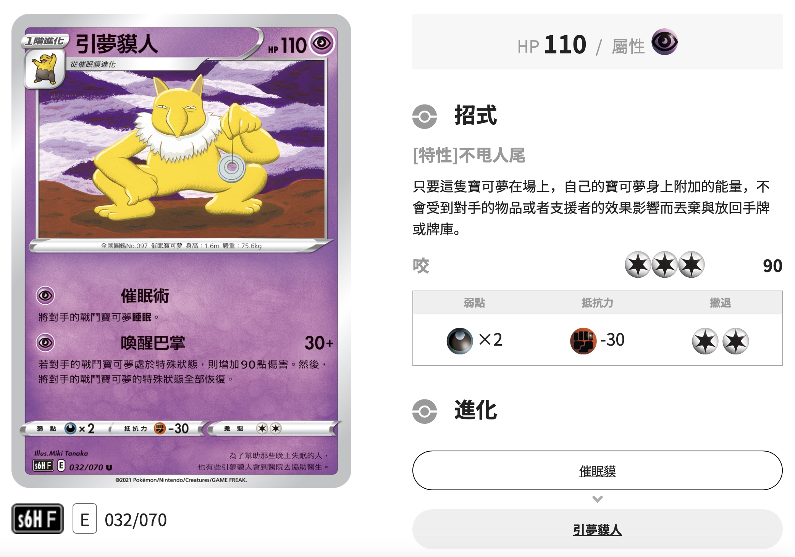

# Pokémon Card Database

Card information for Pokemon TCG. Potential use for data analysis.

## Card Download 

>Official and unofficial sources, such as tcgo, tcgl, carddex, pokemon.com, pkmncards.com, etc. ([malie.io](https://malie.io/static/draft/html/pkproto_sv.html))

### English version

>The official Pokémon.com has TCG [database](https://www.pokemon.com/us/pokemon-tcg/pokemon-cards) but the card images are low quality.

Info source: [pkmncards](www.pkmncards.com)

Image source: [malie.io](https://malie.io/static/)

### Japanese Version

Source: [Official Japan Pokemon Card Website](https://www.pokemon-card.com/card-search/)

### Traditional Chinese Version

Source: [Pokemon Asia - Taiwan](https://asia.pokemon-card.com/tw/card-search/list/)

- The Pokemon Asia [website](https://asia.pokemon-card.com) contains other languages as well (including Indonesia, Thailand, and other regions using English Version) but not Simplified Chinese. So the [scraper](code/downloadCardTC.py) for Traditional Chinese can be used for these Asian regions with trivial changes.
- It is very similar to the [Japanese website](https://www.pokemon-card.com/card-search/index.php).

**⚠️ Warning:** The attacks section of many cards are messed up. Our scraped result only reflects the website's source code. It may be wrong. Below is an [example](https://asia.pokemon-card.com/hk/card-search/detail/901/).

### TCG Pocket

Add TCG Pocket data on Feb 18, 2025. 

It is a [simplified version](https://game8.co/games/Pokemon-TCG-Pocket/archives/474638) of Pokémon TCG, which makes it a better case to test [RL in PTCG](https://github.com/type-null/PTCG-ai).

Source: [limitlesstcg.com](https://pocket.limitlesstcg.com/cards) (English)

## Card Data

Good reference: [malie.io Pokémon Trading Card Game export format](https://malie.io/static/draft/html/pkproto_sv.html), it has great illustration of different fields.

Example:

    
Click to expand JSON

<pre><code>
{
    "language": "en-US",    [REQUIRED]
    "jp_id": "",            [REQUIRED]
    "url": "https://pkmncards.com/card/golisopod-sun-moon-promos-smp-sm52/",
                            [REQUIRED]
    "img": "https://pkmncards.com/wp-content/uploads/en_US-Promo_SM-SM52-golisopod.jpg", 
                            [REQUIRED]
    "card_type": "Pokemon", [REQUIRED] 
                                <Pokemon/Trainer/Energy>
    "sub_type": "",         [OPTIONAL]
                                <Trainer: Item/Supporter/Stadium/Pokemon Tool>
                                <Energy: Basic/Special>
    "name": "Golisopod",    [REQUIRED]
    "authors": ["Naoki Saito"], 
                            [OPTIONAL]
    "regulation": "",       [OPTIONAL]
                                <A/B/C/D/E/F/G/...>
    "set_name": "SM PROMO", [REQUIRED]
    "set_img": "",          [OPTIONAL]
    "number": "SM52",       [REQUIRED]
    "rarity": "PROMO",      [OPTIONAL]
    "tags": [],             [OPTIONAL]
                                <Ancient/Future, Shiny, Tera>
    "technical_machine_rule": "",
                            [OPTIONAL]
    "abilities": [
        {
            "name": "Armor",
            "text": "This Pokémon takes 30 less damage from attacks (after applying Weakness and Resistance).",
        },
    ],                      [OPTIONAL]
    "ancient_trait": {
        "name": "",
        "effect": "",
    },                      [OPTIONAL]
    "poke_power": {
        "name": "",
        "effect": "",
    },                      [OPTIONAL]
    "poke_body": {
        "name": "",
        "effect": "",
    },                      [OPTIONAL]
    "held_item": {
        "item": "",
        "effect": "",
    },                      [OPTIONAL]
    "held_berry": {
        "berry": "",
        "effect": "",
    },                      [OPTIONAL]
    "attack": [
        {
            "cost": ["Grass", "Colorless", "Colorless"],
            "name": "Resolute Claws",
            "damage": {
                "amount": 80,
                "suffix": "+",
            },
            "text": "If your opponent’s Active Pokémon is a Pokémon-GX or a Pokémon-EX, this attack does 70 more damage (before applying Weakness and Resistance).",
        },
    ],                      [OPTIONAL]
    "vstar_power": {}       [OPTIONAL]
    "reminder": "",         [OPTIONAL]
                                <You may play only 1 Supporter card during your turn.>
    "rule_box": {
        "name": "",             <Pokémon ex rule>
        "rule": "",             <When your Pokémon ex is Knocked Out, your opponent takes 2 Prize cards.>
    },                      [OPTIONAL]
    "effect": "",           [OPTIONAL]
                                <Search your deck for an Item card and a Pokémon Tool card, reveal them, and put them into your hand. Then, shuffle your deck.>
    "tera_effect": "",      [OPTIONAL]
                                <As long as this Pokémon is on your Bench, prevent all damage done to this Pokémon by attacks (both yours and your opponent’s).>
    "stage": "STAGE1",      [REQUIRED]
    "evolve_from": "Wimpod",
                            [REQUIRED]
    "hp": 130,              [REQUIRED]
    "types": ["Grass"],     [REQUIRED]
    "weakness": {
        "types": ["Fire"],
        "value": "×2",
    },                      [OPTIONAL]
    "resistance": {
        "types": [],
        "value": "",
    },                      [OPTIONAL]
    "retreat": 2,           [REQUIRED]
    "flavor_text": "With a flashing slash of its giant sharp claws, it cleaves seawater—or even air—right in two.",
                            [OPTIONAL]
    "pokedex_number": 768,  [OPTIONAL]
    "pokemon_category": "Hard Scale Pokémon",
                            [OPTIONAL]
    "height": "6'07\"",     [OPTIONAL]
    "weight": "238.1 lbs",  [OPTIONAL]
}
</code></pre>

Omitted:
- name
    - "subtitle": e.g., "Profesor Turo" in "Professor's Research"
    - "prefix": e.g., "Paldean" in Paldean Pokemon
    - "suffix": e.g., "with Grey Felt Hat" in Van Gogh Pikachu
- "copyright": {"text": "©2024 Pokémon / Nintendo / Creatures / GAME FREAK", ...}

Type symbols:
|  |  |  |  |  |  |  |  |  |  |  |
|-------------------------------|-----------------------------|-------------------------------|--------------------------------------|-----------------------------------|-------------------------------------|---------------------------------|-------------------------------|-------------------------------|---------------------------------|-------------------------------------|
| `{G}`                         | `{R}`                       | `{W}`                         | `{L}`                                | `{P}`                             | `{F}`                               | `{D}`                           | `{M}`                         | `{Y}`                         | `{N}`                           | `{C}`                               |

Gender symbols: E.g., [Nidoran♀](https://www.pokemon-card.com/card-search/details.php/card/43350/) 
| UTF-8 | JSON unicode|
|-------|-------------|
|♀      |\u2640       |
|♂      |\u2642       |

English Rarity key, SV1-onwards:
|  |  |  |  |  |  |  |  |  |  |  |  |
|-------------------------------------------------------------------------|--------------------------------------------------------------|----------------------------------------------------------------------|------------------------------------------------|------------------------------------------------------------------------|----------------------------------------------------------------------|----------------------------------------------------------------------------------|------------------------------------------------------------------------------------------|----------------------------------------------------------------------|----------------------------------------------------------------------|----------------------------------------------------------------------------------|---------------|
| promo                                                                   | common                                                       | uncommon                                                             | rare                                           | double rare                                                               | ultra rare                                                           | illustration rare                                                             | special illustration rare                                                                 | hyper rare                                                           | shiny rare                                                           | shiny ultra rare                                                     | ace spec rare |

Pocket Rarity key:
|`Empty`|||||||||
|-|-|-|-|-|-|-|-|-|
|promo|1 diamond|2 diamond|3 diamond| 4 diamond|1 star|2 star|3 star|crown|

## Downloaded data

### Japanese version

- Info
    - Card content: [`data_jp/`](data_jp/)
        - `/data_jp/set_name/<individual-card>.json`
        - `set_name` is automatically scraped from the set image under the card image shown on the webpage
		- Last jp downloaded time: September 03, 2025
		- Last jp downloaded card_id: 48307
    - Logs: [`logs/`](logs/)
        - [scrape_jp_log](logs/scrape_jp_log.log): Information on scraping cards
        - [log_file](logs/log_file.log): for debugging
        - [scraped_jp_id_list](logs/scraped_jp_id_list.txt): card ids for scraped cards
        - [question_jp_id_list](logs/question_jp_id_list.txt): card ids for dubious scraping results
        - [error_jp_id_list](logs/error_jp_id_list.txt): card ids that has no webpage

- Image
    - Set package cover: See table [here](https://type-null.github.io/card/2024/02/timeline.html)
    - Card image: Haven't downloaded, but the urls for image are saved in their `.json` files
    - Set logo imgae: Same as above
    - Rarity image: Same as above

### English version

- Info
    - Card content: [`data_en/`](data_en/)
        - `/data_en/series/set_name/<individual-card>.json`
        - `series` and `set_name` are automatically scraped from the set image under the card image shown on the webpage
		- Last en downloaded time: September 03, 2025
		- Last en downloaded card_id: None

    - Logs: [`logs/`](logs/)
        - [scrape_en_log](logs/scrape_en_log.log): Information on scraping cards
        - [scraped_en_set_list](logs/scraped_en_set_list.txt): set names for downloaded cards

### Traditional Chinese version

- Info
    - Card content: [`data_tc/`](data_tc/)
        - `/data_tc/series/set_name/<individual-card>.json`
        - `series` and `set_name` are automatically scraped from the set image under the card image shown on the webpage
		- Last tc downloaded time: August 06, 2025
		- Last tc downloaded card_id: 13185

    - Logs: [`logs/`](logs/)
        - [scrape_tc_log](logs/scrape_tc_log.log): Information on scraping cards
        - [scraped_tc_id_list](logs/scraped_tc_id_list.txt): set names for downloaded cards
        - [question_tc_id_list](logs/question_tc_id_list.txt): card ids for dubious scraping results
        - [missing_tc_id_list](logs/missing_tc_id_list.txt): card ids that has no webpage

- Todo
    - Some cards have dirty `set_name`s, such as '-1', 'svf.png', and 'SN-F@4x.png' due to incomprehensive regex. 
        - Need to clean these cards.
    - Some cards have mismatch texts on the website, such as [example](https://asia.pokemon-card.com/hk/card-search/detail/901/) shown in above **warning**. 
        - Need to correct the data input.
    - The ids of cards are not consecutive all the way from 2 to current. Thus, a lot of ids have no card attached. But these ids might be used in the future. 
        - Need to examine these ids when update the card pool. 
        - Or, can just update the new cards by set.

### TCG Pocket

- Info
    - Card content: [`data_pocket/`](data_pocket/)
        - `/data_pocket/series/set_name/<individual-card>.json`
        - `series` and `set_name` are automatically scraped from the set image under the card image shown on the webpage
		- Last pocket downloaded time: September 03, 2025
		- Last pocket downloaded card_id: A4a-105
    
    - Logs: [`logs/`](logs/)
        - [scrape_pocket_log](logs/scrape_pocket_log.log): Information on scraping cards
        - [scraped_pocket_set_list](logs/scraped_pocket_set_list.txt): set names for downloaded cards

## Maintainer

This project is maintained and developed by [type-null](https://github.com/type-null).
