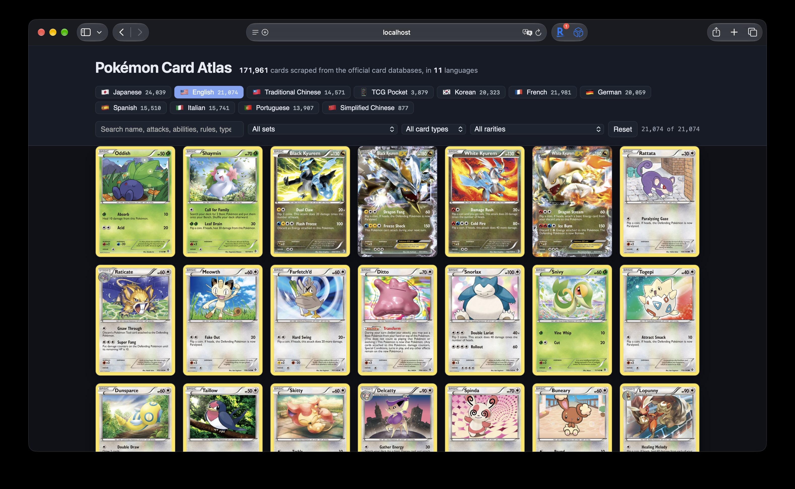
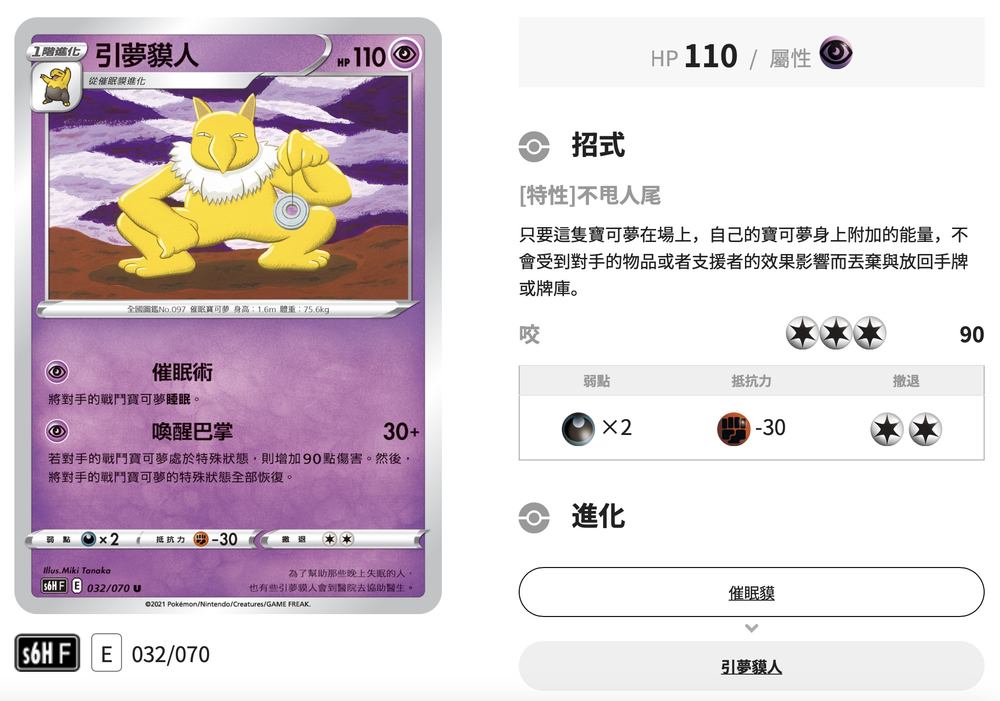

# Pokémon Card Database

<!-- badges: written by code/update.py -->


<!-- end badges -->

Card information for Pokemon TCG. Potential use for data analysis.

## Quick start

The project uses [uv](https://docs.astral.sh/uv/) for its environment.

```bash
uv sync                               # create .venv and install dependencies
uv run code/update.py                 # bring everything up to date
```

`update.py` is the one command to run. It calls the scripts below in the order
their results depend on each other — new cards, repairs, identity keys, English
type names, the search index, the pictures and their checksums, the tests — and
then rewrites the counts in this file so they cannot quietly go stale.

```bash
uv run code/update.py                  # everything
uv run code/update.py --no-pictures    # skip the long download
uv run code/update.py jp en            # only these languages
uv run code/update.py --list           # show the steps and stop
```

Nothing in it is destructive: every step skips what it already holds, so running
it twice in a row downloads nothing the second time. It stops at the first step
that fails and leaves the counts alone, so a half-finished run never publishes
numbers it cannot stand behind.

`updateDatabase.py` is the card-downloading step inside it, and still runs on its
own. Each source lists what it publishes, compares that against what is already
stored, and downloads only the difference.

```bash
uv run code/updateDatabase.py --list        # the sources and their defaults
uv run code/updateDatabase.py jp en         # only these sources
uv run code/updateDatabase.py --all         # include the newer languages
uv run code/updateDatabase.py jp --limit 20 # a short trial run
uv run code/updateDatabase.py --delay 2     # go easier on the site
uv run code/updateDatabase.py --verbose     # log every field that is read
```

Requests are paced (one per second by default, with jitter), retried with a
widening back-off, and slowed further when a site answers 429 or 403, so a
long run stays polite. Every source also writes its own log under `logs/`.

| Command | What it does |
|---|---|
| **`uv run code/update.py`** | **everything, in order: new cards, keys, types, index, pictures, README counts** |
| `uv run code/updateDatabase.py` | download new cards for every default source |
| `uv run code/buildIndex.py` | rebuild the search index the viewer reads |
| `uv run code/linkCards.py` | fill in the identity keys that link a card to its other printings |
| `uv run code/fillPokedex.py` | give a Japanese or Korean card the Pokédex number its name states (`--apply` to write) |
| `uv run code/canonicalTypes.py` | give every card an English name for its energy types |
| `uv run code/repairDatabase.py` | report data problems (add `--apply` to fix) |
| `uv run code/checkDatabase.py` | report what is missing or surprising in the stored cards |
| `uv run code/downloadImages.py` | archive card images beside the repo (`--apply` to fetch, `--verify` to checksum) |
| `uv run code/test_scrapers.py` | run the parsing tests (no network needed) |

The single-source shortcuts `downloadCardJP.py`, `downloadCardEN.py`,
`downloadCardTC.py` and `downloadCardPocket.py` still work and take the same
options.

## Card viewer



Everything in this repository is JSON on disk, which is good for analysis and
poor for looking at. `docs/index.html` is the other half: one static page that
searches every card stored here, across eleven languages, shows every field of
the one you open, puts its picture beside it, and lets you step between the same
card's printings in other languages without losing your place.

It is one file. It fetches nothing from the network — no fonts, no scripts, no
card sites — and reads only what is beside it: the indexes under `docs/index/`
and the pictures in the archive next to the repository.

```bash
uv run code/buildIndex.py     # writes docs/index/*.json
python3 -m http.server        # from the repository root
# then open http://localhost:8000/docs/
```

A local server is needed only because browsers refuse to read sibling files
from a `file://` page; nothing is served anywhere else.

**Rebuilding needs no restart.** The server reads each file off disk as it is
asked for, so `buildIndex.py` — or a whole `update.py` run — is picked up by the
page it is already serving. Reload with ⌘⇧R rather than a plain reload, or the
browser answers from its own cache.

Leave it running, then. `Address already in use` means it already is, and the
running one is serving the current files. To find it, and to see which directory
it serves before trusting it:

```bash
lsof -ti:8000                          # the process id, and nothing else
lsof -a -p $(lsof -ti:8000) -d cwd     # the folder it serves — should be this one
kill $(lsof -ti:8000)                  # stop it, if the port is what you want
python3 -m http.server 8001            # or just leave it and use another port
```

What it shows:

- **Every field a card stores.** The index carries the whole record, so opening
  a card lists all of it — attacks, abilities, weakness, retreat, illustrator,
  flavour text, both identity keys, the picture's url — labelled and in order.
- **The card's picture**, read from the archive beside the repository through the
  ignored `images` link. A card whose picture has not been downloaded, or whose
  source publishes none, is *drawn* instead from its own record: a face tinted by
  its energy type carrying name, set, number, rarity and HP.
- **The same card in another language, in place.** Choosing one of the versions
  listed under a card replaces what is on screen with that language's own
  record — its name, its set, its rarity, its rules text, its picture — without
  disturbing the list behind it.
- **Sets named in full, and an order you choose.** The set filter lists each set
  by its title beside its code — `SCR — Stellar Crown` — so finding a set does
  not mean knowing what it is abbreviated to. The cards themselves can be put in
  set order, newest first, or oldest first. English, the European languages and
  Simplified Chinese publish a release date; Japanese, Korean, Traditional
  Chinese and TCG Pocket publish none, so those are ordered by the numbering
  their own sites issue, which runs the same way.

`docs/index/` is build output and is **not** committed: `buildIndex.py` rebuilds
it from the stored cards whenever you ask.

The page could be served from anywhere, but the pictures could not follow it —
they live in a 52 GB archive outside the repository, and a hosted page may only
load images it ships with. Keeping the viewer local is what lets it show them
full size.

## Repository size

The card files are small individually and many in total: roughly 670 MB. No
single file comes near GitHub's 100 MB block or its 50 MB warning, so the
repository pushes normally.

<!-- numbers: written by code/update.py -->

**172,361 cards** across 11 languages, as of the last update.

| language | cards | sets |
| --- | --- | --- |
| `de` | 20,247 | 146 |
| `en` | 21,086 | 195 |
| `es` | 15,510 | 112 |
| `fr` | 22,169 | 198 |
| `it` | 15,741 | 114 |
| `jp` | 24,039 | 329 |
| `ko` | 20,323 | 264 |
| `pocket` | 3,879 | 23 |
| `pt` | 13,907 | 92 |
| `sc` | 877 | 8 |
| `tc` | 14,583 | 134 |

- **32,902 printings** and **18,602 cards** are stored in more than one version
- **158,546 pictures** archived beside the repository, 52 GB

<!-- end numbers -->

What is deliberately kept out of git, because it is rebuilt rather than
authored: `.venv/`, `logs/run_*.out` (console output of a run), and
`docs/index/` (the viewer's search index — about 205 MB, since it carries every
field of every card, rebuilt by `buildIndex.py` in under a minute).

The card pictures are not in the repository at all. They are archived in
`../PTCG-card-images/`, a folder beside it, so git cannot see them even by
accident; `images` is an ignored symlink pointing there, which is how the
local viewer finds them.

## Card Download

>Official and unofficial sources, such as tcgo, tcgl, carddex, pokemon.com, pkmncards.com, etc. ([malie.io](https://malie.io/static/draft/html/pkproto_sv.html))

### English version

>The official Pokémon.com has TCG [database](https://www.pokemon.com/us/pokemon-tcg/pokemon-cards) but the card images are low quality.

Info source: [pkmncards](https://pkmncards.com)

Image source: [malie.io](https://malie.io/static/)

Every set is re-checked on each run, because promo sets keep growing after
their release; cards already stored are skipped by their url.

### Japanese Version

Source: [Official Japan Pokemon Card Website](https://www.pokemon-card.com/card-search/)

Card ids are listed through the site's own search API rather than guessed one
after another, so a gap in the id space cannot hide the cards behind it.

### Traditional Chinese Version

Source: [Pokemon Asia - Taiwan](https://asia.pokemon-card.com/tw/card-search/list/)

- The Pokemon Asia [website](https://asia.pokemon-card.com) serves several
  regions from one layout and one set of card ids. The same scraper covers
  them: `tc` (Taiwan), `hk` (Hong Kong), `th` (Thai), `id` (Indonesian), and
  `sg`, `my`, `ph` (English). Pick one with
  `uv run code/updateDatabase.py hk`.
- It is very similar to the [Japanese website](https://www.pokemon-card.com/card-search/index.php).

**⚠️ Warning:** The attacks section of many cards are messed up. Our scraped result only reflects the website's source code. It may be wrong. Below is an [example](https://asia.pokemon-card.com/hk/card-search/detail/901/).


### Korean Version

Source: [Pokémon Korea](https://pokemoncard.co.kr/cards)

Added September 2026. Card numbers are listed through the page's own request,
30 at a time, and each card is then read from `/cards/detail/<card number>`.

### Other languages

French, German, Spanish, Italian, Portuguese and Simplified Chinese have no
official card database that can be read the way the sites above can — the
Simplified Chinese TCG in particular publishes no card list at all. For those,
[TCGdex](https://tcgdex.dev) serves the full card text as JSON, not just
pictures, so it fills the gap:

```bash
uv run code/updateDatabase.py fr     # also de, es, it, pt, sc
```

They land in `data_fr/`, `data_de/`, `data_es/`, `data_it/`, `data_pt/` and
`data_sc/`. Every card records `{"name": "TCGdex", "link": …}` under
`sources`, so data from the community API is never mistaken for data read
from an official site.

Coverage is uneven, and the set list overstates it: a set can advertise a
card count while holding no card records at all. Every language has some of
these, so the scraper logs `Set <id> claims N cards but serves none` and the
real total is whatever the run reports as downloaded — not the sum of the
set counts.

French is the best served of them, with only 5 sets advertising cards the API
cannot serve.

Simplified Chinese is the extreme case: `data_sc/` holds only the 8 sets that
carry records, out of 57 sets that together claim 6,962 cards.
It also publishes no card pictures, so `img` is empty there; the card text
is complete.

There is no better Simplified Chinese source to switch to: the Pokémon Asia
site serves no `cn`/`sc`/`zh` locale, `pokemon.cn` publishes product news but
no card search, and the community sites that once did are gone. What
`data_sc/` holds is the whole structured corpus that exists.

German is the next best served, ahead of Spanish, Italian and Portuguese in
`data_de/`, `data_es/`, `data_it/` and `data_pt/` — the table under **Repository
size** carries what each holds. Every one of them also met sets that advertise
cards the API will not serve — 9 in German, 44 in Spanish, 79 in Italian, 32 in Portuguese — which
is why a real total is what a run downloads, never what its set list claims.

### TCG Pocket

Add TCG Pocket data on Feb 18, 2025.

It is a [simplified version](https://game8.co/games/Pokemon-TCG-Pocket/archives/474638) of Pokémon TCG, which makes it a better case to test [RL in PTCG](https://github.com/type-null/PTCG-ai).

Source: [limitlesstcg.com](https://pocket.limitlesstcg.com/cards) (English)

## Card Data

Good reference: [malie.io Pokémon Trading Card Game export format](https://malie.io/static/draft/html/pkproto_sv.html), it has great illustration of different fields.

Example:
<details>
    <summary>Click to expand JSON</summary>
<pre><code>
{
    "language": "en-US",    [REQUIRED]
    "jp_id": "",            [REQUIRED]
    "url": "https://pkmncards.com/card/golisopod-sun-moon-promos-smp-sm52/",
                            [REQUIRED]
    "img": "https://pkmncards.com/wp-content/uploads/en_US-Promo_SM-SM52-golisopod.jpg", 
                            [REQUIRED]
    "card_type": "Pokemon", [REQUIRED] 
                                <Pokemon/Trainer/Energy>
    "sub_type": "",         [OPTIONAL]
                                <Trainer: Item/Supporter/Stadium/Pokemon Tool>
                                <Energy: Basic/Special>
    "name": "Golisopod",    [REQUIRED]
    "authors": ["Naoki Saito"], 
                            [OPTIONAL]
    "regulation": "",       [OPTIONAL]
                                <A/B/C/D/E/F/G/...>
    "set_name": "SM PROMO", [REQUIRED]
    "set_img": "",          [OPTIONAL]
    "number": "SM52",       [REQUIRED]
    "rarity": "PROMO",      [OPTIONAL]
    "tags": [],             [OPTIONAL]
                                <Ancient/Future, Shiny, Tera, Mega Evolution>
    "technical_machine_rule": "",
                            [OPTIONAL]
    "abilities": [
        {
            "name": "Armor",
            "text": "This Pokémon takes 30 less damage from attacks (after applying Weakness and Resistance).",
        },
    ],                      [OPTIONAL]
    "ancient_trait": {
        "name": "",
        "effect": "",
    },                      [OPTIONAL]
    "poke_power": {
        "name": "",
        "effect": "",
    },                      [OPTIONAL]
    "poke_body": {
        "name": "",
        "effect": "",
    },                      [OPTIONAL]
    "held_item": {
        "item": "",
        "effect": "",
    },                      [OPTIONAL]
    "held_berry": {
        "berry": "",
        "effect": "",
    },                      [OPTIONAL]
    "attack": [
        {
            "cost": ["Grass", "Colorless", "Colorless"],
            "name": "Resolute Claws",
            "damage": {
                "amount": 80,
                "suffix": "+",
            },
            "text": "If your opponent’s Active Pokémon is a Pokémon-GX or a Pokémon-EX, this attack does 70 more damage (before applying Weakness and Resistance).",
        },
    ],                      [OPTIONAL]
    "vstar_power": {}       [OPTIONAL]
    "reminder": "",         [OPTIONAL]
                                <You may play only 1 Supporter card during your turn.>
    "rule_box": {
        "name": "",             <Pokémon ex rule>
        "rule": "",             <When your Pokémon ex is Knocked Out, your opponent takes 2 Prize cards.>
    },                      [OPTIONAL]
    "mega_evolves_from": "Venusaur",
                            [OPTIONAL]
                                <the Pokémon a Mega Evolution card is the Mega-Evolved form of>
    "effect": "",           [OPTIONAL]
                                <Search your deck for an Item card and a Pokémon Tool card, reveal them, and put them into your hand. Then, shuffle your deck.>
    "tera_effect": "",      [OPTIONAL]
                                <As long as this Pokémon is on your Bench, prevent all damage done to this Pokémon by attacks (both yours and your opponent’s).>
    "stage": "STAGE1",      [REQUIRED]
    "evolve_from": "Wimpod",
                            [REQUIRED]
    "hp": 130,              [REQUIRED]
    "types": ["Grass"],     [REQUIRED]
    "weakness": {
        "types": ["Fire"],
        "value": "×2",
    },                      [OPTIONAL]
    "resistance": {
        "types": [],
        "value": "",
    },                      [OPTIONAL]
    "retreat": 2,           [REQUIRED]
    "flavor_text": "With a flashing slash of its giant sharp claws, it cleaves seawater—or even air—right in two.",
                            [OPTIONAL]
    "pokedex_number": 768,  [OPTIONAL]
    "pokemon_category": "Hard Scale Pokémon",
                            [OPTIONAL]
    "height": "6'07\"",     [OPTIONAL]
    "weight": "238.1 lbs",  [OPTIONAL]
}
</code></pre>

Omitted:
- name
    - "subtitle": e.g., "Profesor Turo" in "Professor's Research"
    - "prefix": e.g., "Paldean" in Paldean Pokemon
    - "suffix": e.g., "with Grey Felt Hat" in Van Gogh Pikachu
- "copyright": {"text": "©2024 Pokémon / Nintendo / Creatures / GAME FREAK", ...}
</details>

Re-scraping a card rewrites its own file and keeps any field an earlier scrape
stored, so a card is only ever added to, never replaced by a thinner copy.

### Linking one card to its other printings

Every card carries two identity keys, derived from its own fields when it is
saved — so a card downloaded tomorrow links itself to the rest without
anything being rebuilt.

`print_key` is the exact one. Japan, Korea, Taiwan and the other Pokémon Asia
regions number a set identically, so `asia:M6a-18` names one printing in all of
them — ピカチュウ, 피카츄 and 皮卡丘 are that card. The languages TCGdex serves share
one set id the same way (`tcgdex:sv01-165`), and English keeps a namespace of
its own. Leading zeros are dropped: one source writes `018` where another writes
`18` for the same card, and no set numbers two different cards `01` and `1`.

Simplified Chinese sits with the Asia regions rather than with the languages
TCGdex serves, because that is how it is numbered: its sets are `SV7`, `SV8`,
`SV10`, Japan's own codes. Of the 829 positions Japan also holds, 541 are
provably the same Pokémon and **none** is a different one. Taiwan respells five
of Japan's sets with a trailing `F` — `SV2a F`, `SV3 F`, `SV9aF`, `SV11BF`,
`SVP1 F` — and those are aliased to Japan's spelling, on the same evidence: 469
shared numbers, the same Pokémon, none different. Only those five; Japan has
sets genuinely called `SVF` and `MF`.

TCG Pocket is one namespace across every language. limitlesstcg publishes a
set's full name while TCGdex publishes its id, so the id is filled in from the
folder those cards already sit in, and `pocket:A1-1` is Bulbasaur, Bulbizarre
and Bisasam alike — 2,143 printings that linked to nothing before.

A "number" that is not a number — a promo numbered with its own set code, or
`n/a` — gets no key rather than one that lumps unrelated cards together. A few
sets go further and reuse a number outright: Japanese and Korean promos print
several unrelated cards as `001`. Such a key is real but names no single card,
so `buildIndex.py` leaves that group out of `links.json` rather than offer
strangers as versions of each other, and reports how many it dropped. Names are
compared with punctuation stripped first, because Traditional Chinese stores one
name both with and without its angle brackets.

`card_key` is the fingerprint, and it spans both languages **and** rarities:
Pokédex number, HP, retreat cost, illustrator, and the damage and cost pattern
of the attacks. Translation changes none of those.

A card's marks are folded to one form first. TCGdex writes `120+` where the
Japanese, Korean and Chinese sites write the full-width `120＋`, and that single
character used to split one card into two fingerprints: folding it brought
**3,497 more cards** within reach of another language, 3,113 of them Japanese,
and cost nothing anywhere. It is what makes a search in
one language find the card in another, and what groups a card printed once as
a common and again as an illustration rare.

The Pokédex number is what keeps that fingerprint honest — without it, cards
sharing only an artist and a damage figure collapse together, measured at 8.7%
wrong matches. pkmncards and TCG Pocket publish no Pokédex number, so for those
the species is read from the card name (`Iono's Tadbulb` → Tadbulb, 938) using
[`code/species_dex.json`](code/species_dex.json), a name-to-number table taken
once from PokéAPI. A name that cannot be placed leaves the card unfingerprinted
rather than in the wrong group. Trainer and Energy cards have no Pokédex number
or attacks at all, so they link by exact printing only.

What a structural fingerprint cannot do is separate cards that are genuinely
built alike. Unown A to Z share a Pokédex number, HP, retreat cost, illustrator
and attack, and differ only by a letter in the name; so do the Team Boss
Pikachu promos. Six such families exist, covering 111 cards, and `buildIndex.py`
leaves them out of `links.json` — a language contributing three or more names to
one fingerprint is a family, not a card, while the two names of a translation or
a spelling variant are kept. Two cards that differ only in name and in nothing
measurable, such as Black and White Kyurem EX, do still share a fingerprint.

Card types would separate those, but they are stored as each source prints them
— `Feuer`, `Feu`, `Fuego` — and even the English-language sources disagree
(`Lightning` against `Electric`). Adding them as printed was measured and
rejected outright: it cut cross-language matches from 17,692 to 12,277.

Translating them into one vocabulary first — which the links themselves can do,
see [`code/canonicalTypes.py`](code/canonicalTypes.py) — costs no matches, but
it resolves only 2 of the 41 look-alike collisions. Rewriting every fingerprint
in the database to settle two cards is not a good trade, and the six families
that actually mislead are already kept out of `links.json`, so the fingerprint
stays as it is.

The translation earns its place elsewhere. Every card now carries `types_en`
beside the `types` it prints, with no name the links could not place, and the
index searches both, so `Fire` finds `Feuer`, `Fuego` and `Feu`
while `Feuer` still finds the card in front of you.

```bash
uv run code/linkCards.py            # report what the keys link
uv run code/linkCards.py --apply    # fill the keys into cards scraped earlier
```

`buildIndex.py` also writes `docs/index/links.json`, holding only the groups
with more than one member, which is what lets the viewer show a card's other
languages and rarities without loading every language's index. How many
printings and cards that comes to is counted under **Repository size** above,
and it leaves out the 332 printings and 6 look-alike families that name no
single card.

Type symbols:
|  |  |  |  |  |  |  |  |  |  |  |
|-------------------------------|-----------------------------|-------------------------------|--------------------------------------|-----------------------------------|-------------------------------------|---------------------------------|-------------------------------|-------------------------------|---------------------------------|-------------------------------------|
| `{G}`                         | `{R}`                       | `{W}`                         | `{L}`                                | `{P}`                             | `{F}`                               | `{D}`                           | `{M}`                         | `{Y}`                         | `{N}`                           | `{C}`                               |


Gender symbols: E.g., [Nidoran♀](https://www.pokemon-card.com/card-search/details.php/card/43350/) 
| UTF-8 | JSON unicode|
|-------|-------------|
|♀      |♀       |
|♂      |♂       |

English Rarity key, SV1-onwards:
|  |  |  |  |  |  |  |  |  |  |  |  |
|-------------------------------------------------------------------------|--------------------------------------------------------------|----------------------------------------------------------------------|------------------------------------------------|------------------------------------------------------------------------|----------------------------------------------------------------------|----------------------------------------------------------------------------------|------------------------------------------------------------------------------------------|----------------------------------------------------------------------|----------------------------------------------------------------------|----------------------------------------------------------------------------------|---------------|
| promo                                                                   | common                                                       | uncommon                                                             | rare                                           | double rare                                                               | ultra rare                                                           | illustration rare                                                             | special illustration rare                                                                 | hyper rare                                                           | shiny rare                                                           | shiny ultra rare                                                     | ace spec rare |


The Mega Evolution era added rarities that have no icon in the table above:
`Mega Hyper Rare` and `Mega Attack Rare` in English, `rare_ma` and `rare_MUR`
in Japanese. A rarity is stored exactly as the source writes it rather than
matched against a fixed list, so a new one is picked up without a code change.

Pocket Rarity key:
|`Empty`|||||||||
|-|-|-|-|-|-|-|-|-|
|promo|1 diamond|2 diamond|3 diamond| 4 diamond|1 star|2 star|3 star|crown|

## Downloaded data

### Japanese version

- Info
    - Card content: [`data_jp/`](data_jp/)
        - `/data_jp/set_name/<individual-card>.json`
        - `set_name` is automatically scraped from the set image under the card image shown on the webpage
		- Last jp downloaded time: September 16, 2026
		- Last jp downloaded card_id: 50777
    - Logs: [`logs/`](logs/)
        - [scrape_jp_log](logs/scrape_jp_log.log): Information on scraping cards
        - [scraped_jp_id_list](logs/scraped_jp_id_list.txt): card ids for scraped cards
        - [question_jp_id_list](logs/question_jp_id_list.txt): card ids for dubious scraping results
        - [error_jp_id_list](logs/error_jp_id_list.txt): card ids that has no webpage

- Image
    - Set package cover: See table [here](https://type-null.github.io/card/2024/02/timeline.html)
    - Card image: Not stored in git; `code/downloadImages.py` fetches them into `../PTCG-card-images/`, beside the repository
    - Set logo imgae: Same as above
    - Rarity image: Same as above


### English version

- Info
    - Card content: [`data_en/`](data_en/)
        - `/data_en/series/set_name/<individual-card>.json`
        - `series` and `set_name` are automatically scraped from the set image under the card image shown on the webpage
		- Last en downloaded time: September 17, 2026
		- Last en downloaded card_id: MEP-091

    - Logs: [`logs/`](logs/)
        - [scrape_en_log](logs/scrape_en_log.log): Information on scraping cards
        - [scraped_en_set_list](logs/scraped_en_set_list.txt): set names for downloaded cards


### Traditional Chinese version

- Info
    - Card content: [`data_tc/`](data_tc/)
        - `/data_tc/set_name/<individual-card>.json`
        - `set_name` is the official set code the site publishes
		- Last tc downloaded time: September 17, 2026
		- Last tc downloaded card_id: 20098

    - Logs: [`logs/`](logs/)
        - [scrape_tc_log](logs/scrape_tc_log.log): Information on scraping cards
        - [scraped_tc_id_list](logs/scraped_tc_id_list.txt): set names for downloaded cards
        - [question_tc_id_list](logs/question_tc_id_list.txt): card ids for dubious scraping results
        - [missing_tc_id_list](logs/missing_tc_id_list.txt): card ids that has no webpage

- The other Pokémon Asia locales land in `data_hk/`, `data_th/`, `data_id/`,
  `data_sg/`, `data_my/` and `data_ph/` with the same layout.

### Korean version

- Info
    - Card content: [`data_ko/`](data_ko/)
        - `/data_ko/set_name/<individual-card>.json`
		- Last ko downloaded time: September 16, 2026
		- Last ko downloaded card_id: BS2026006114
    - Logs: [`logs/`](logs/)
        - [scrape_ko_log](logs/scrape_ko_log.log): Information on scraping cards
        - [scraped_ko_id_list](logs/scraped_ko_id_list.txt): card numbers for scraped cards

### Other languages (TCGdex)

- Info
    - Card content: `data_fr/`, `data_de/`, `data_es/`, `data_it/`, `data_pt/`, [`data_sc/`](data_sc/)
        - `/data_<lang>/set_code/<individual-card>.json`
        - Every card names TCGdex under `sources`, so community data is never
          mistaken for data read from an official site.
        - Simplified Chinese publishes no card pictures, so `img` is empty for
          those cards; the text is complete.
    - Logs: [`logs/`](logs/)
        - `scrape_<lang>_log.log`: Information on scraping cards

### TCG Pocket

- Info
    - Card content: [`data_pocket/`](data_pocket/)
        - `/data_pocket/set_code/<individual-card>.json`
		- Last pocket downloaded time: September 16, 2026
		- Last pocket downloaded card_id: P-A-117
    
    - Logs: [`logs/`](logs/)
        - [scrape_pocket_log](logs/scrape_pocket_log.log): Information on scraping cards
        - [scraped_pocket_set_list](logs/scraped_pocket_set_list.txt): set names for downloaded cards

## Card images

The card pictures run to tens of gigabytes — **Repository size** above carries
the current figure — far too much for git,
so the archive lives *beside* the repository rather than inside it:
`../PTCG-card-images/`, laid out as `<lang>/<set>/<card>.<ext>`.

That is every picture the sources will serve. Of the cards that carry a picture
url, 274 are refused: 404 for cards TCGdex lists but never published
(156 Portuguese, 89 Italian, 21 across German, French and Spanish), 415 for five
Korean assets, 412 for three English ones. Simplified Chinese publishes no
pictures at all, so `data_sc/` has none to archive. `code/downloadImages.py` rebuilds it
from the urls already stored in the card files, skips whatever it already
holds, and records every file in the archive's own `manifest.json` with its
size and SHA-256.

```bash
uv run code/downloadImages.py            # report what is missing
uv run code/downloadImages.py jp --apply # download one language
uv run code/downloadImages.py --apply --dir /Volumes/Archive/ptcg
```

Both viewers work with or without the archive. The local viewer reads it
through the ignored `images` symlink; the hosted Atlas takes an address in its
footer, for anyone serving the folder with `python3 -m http.server`. Either
way a picture the archive lacks falls back to the site the card was read from,
and one that site no longer publishes falls back to a placeholder.

## Maintenance

`code/repairDatabase.py` reports, and with `--apply` fixes, two problems that
built up in earlier runs:

- copies of the same card left behind as `-2`, `-3`, … files. Files that
  share a number but hold a **different** card are real cards and are kept.
- Traditional Chinese set folders named after a set-symbol image
  (`svf.png`, `-1`, …) instead of the set code. A card is only ever moved
  into a folder the site itself names.

## Maintainer

This project is maintained and developed by [type-null](https://github.com/type-null).
